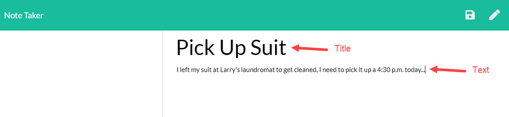

# hw11_notes
Link: https://dry-escarpment-97677.herokuapp.com/

# Table of Contents
1) Descritpion
2) Instructions
3) Additional Information

---
---

# 1) Description
In this application, you will be allow to add, delete and modify notes in a database of notes. This will allow you to keep track of anything that you may forget throughout the day. 

# 2) Instructions
1) Open the link : https://dry-escarpment-97677.herokuapp.com/
2) Click the "Get Started" Button 
3) If there is an empty note, insert your text, other wise click the pencil icon in the top right to begin a new note

4) Click the save icon to save your note to the database. Notice the newly added (clickable) tab in the left column 

# Addition Information
Please find the additional functionality below. 
## Deleting Notes
---
To delete a note, you make click the red trash can on the tab in the left column. 

## Accessing API
---
To access the api of all existing notes, you must change the url to https://dry-escarpment-97677.herokuapp.com/api/notes 
